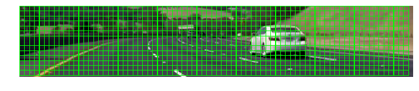

# Vehicle Detection

The goal of this project was to identify vehicles in a video stream, by marking their position with a bounding box.
To achieve this, the following steps were performed:

* Histogram of Oriented Gradients (HOG) feature extraction on a labeled training set of images
* Color feature extraction (histogram based and via spatial binning)
* Training of a binary classifier
* Implementation of a sliding-window technique to search for vehicles in images
* Design and implementation of a heat map technique to suppress outliers and make the detection of vehicles more robust
* Estimation of a bounding box for detected vehicles

All of the code for this project is contained in [this jupyter notebook](https://github.com/Corni33/CarND_P5_VehicleDetection/blob/master/vehicle_detection.ipynb).

## Feature Extraction

A labeled data set of 8797 vehicle and 8970 non-vehicle sample images, each with a size of 64 by 64 pixels and 3 color channels, served as a basis for the task of classification.
In order to train a binary classifier to distinguish vehicles from other objects (e.g. road markings, trees, ...), characteristic featurs of the sample images have to be extracted.  

### Color Features

An example of a vehicle image and one of a non-vehicle image looks like this:

In this case it's easy to see that one possible criterion for classifying the sample images might be color information.
To make use of this information, a histogram for each color channel is calculated (I chose to use 20 histogram bins) and unraveled into a feature vector. It turns out that using YCrCb color space instead of RGB yields better classification results. 
Here are the three color channels of the vehicle image and their corresponding histograms:

And these are the color channels and histograms of the non-vehicle image:

Another way of utilizing color information while also retaining some spatial information, is to just take the raw image pixel values and unravel them into a feature vector.
Doing so for the whole 64 by 64 pixel image would create a huge feature vector (12288 elements!) while not necessarily being of much use, as not all of the pixels contain relevant information about the class of the image.
To cope with this problem the image gets scaled down to a more reasonable resolution that produces a smaller feature vector while still retaining information about the spatial structure of the image.
After some experimentation I chose a downscaled resolution of 16 by 16 pixels:

### HOG Features

<!--Even without color information, a human can easily identify a car in many different situations. -->
Another important feature for detecting vehicles is their characteristic shape and edge distribution. 
In my classification pipeline I used Histogram of Oriented Gradients (HOG) features on all three channels of the YCrCb image to extract information about the orientations of edges in the image (code cell ...).

Applied to the example image of a vehicle, a visualization of the HOG features looks like this:

And for the non-vehicle example it looks like this:

As parameter values for the HOG feature extraction I chose `orientations=8`, `pixels_per_cell=(8, 8)` and `cells_per_block=(2,2)`. 
I tried to increase `pixels_per_cell` to `(16, 16)` (with `orientations` set to 11) to reduce the number of features and therefore speed up the classifier, but this decreased the accuracy of detected bounding boxes, i.e. they fit less tightly around the vehicles.
Decreasing `pixels_per_cell` to `(4, 4)` resulted in a huge feature vector and very long training and classification times. 

## Classifier Training

The classifier takes in a vector of features (containing color and HOG features scaled to zero mean and unit variance) and produces a prediction whether or not an image contains a vehicle.

After scaling the input feature vector (code cell ...) I first started training a Support Vector Machine (SVM) classifier and tried out different kernels (`rbf`, `linear`) and different combinations of parameter values (`C`, `gamma`).
While a well tuned `rbf` kernel showed good testing accuracy (>98%), prediction was quite slow and generalization was only average (i.e. there were quite a few false positives / false negatives while testing it on the project video). 
A well tuned (i.e. a well chosen value for `C`) linear SVM kernel seemed to generally provide better protection against overfitting.
In the end I settled for a Random Forest Classifier (an ensemble of decision trees, see code cell ...) as it could be trained very fast (with a testing accuracy of about 99%) and gave me the least amount of false positives / false negatives of all classification approaches I experimented with.

## Sliding Window Search

The trained classifier is only able to make predictions for 64 by 64 pixel images.  
To search for vehicles of different sizes at different locations in a big image, the image can be sub sampled into many smaller regions that get scaled to the desired size of 64 by 64 pixels and then fed into the classifier. 

I created a class `DetectionLevel` (code cell ...) that has the ability to crop and scale an image to create a sub image.
It can also generate a list of patches (= locations of 64 by 64 px regions) covering the whole sub image (code cell ...).
I use a list of four `DetectionLevel` objects to define how a big image gets split up into sub images and covered by patches (code cell ...).
On an example image the resulting sub images look like this (every contained patch is drawn as a green rectangle):

I chose these specific four subdivisions because I wanted to detect vehicles very close to the ego-vehicle and also far away from it, but still be able to process each frame in a reasonable amount of time.  
To speed up the extraction of HOG features, theses features are only calculated once for every one of the four scale levels and after that sub sampled to get the features for a specific 64 by 64 pixel sub region (code cell ...).

While running the classifier on every single sub region of the image a heat map is produced that contains non-zero values where the classifier predicts a vehicle to be located.
Every vehicle detection adds more "heat" to the map, i.e. the intensity values at the corresponding heat map regions get increased.
Running the sliding window search on a single image gives a heat map like this (drawn over the input image, lighter regions = more heat):

To get the locations of vehicles in the image, a threshold gets applied to the heat map (code cell ...).
The value of this threshold is based on the standard deviation of heat values and limited by fixed upper and lower bounds. 
This is an example of a thresholded heat map:

Bounding boxes are now drawn around every region of the image, where the heat value is bigger than the heat threshold.
The following image is an example for the final output of the vehicle detection pipeline for a single image: 

## Video Processing

The sliding window approach can produce a heat map of vehicle locations for a single image. 
When searching for vehicles in a video stream the additional tracking of vehicle locations over time allows for filtering of false positives. 
The filtering technique I applied was calculating the current heat map by averaging over the last 10 heat maps (code cell ... ), so that some wrong classifications during only a few frames won't influence the final result, i.e. the current heat map, too much. 

I additionally filtered the vehicle bounding boxes by applying a low pass filter to their defining vertices. 
A challenge here was to cope with the case of splitting up and merging rectangles when one vehicle passes another one.
The bounding box filtering is handled in code cell ... .

Here's a [link to the final video](./output.mp4) that shows the whole detection pipeline in action.

## Discussion

Although my vehicle detection pipeline works well on the project video it has some shortcomings and room for improvements.

The bounding boxes don't fit very tightly around the vehicle body all the time. 
Also they still wiggle around quite a bit, even after low pass filtering. 
These two points have to be addressed before considering using the bounding boxes as input for a path planner, or else the vehicle might change its planned behavior too often.

Another shortcoming of the current pipeline is that multiple vehicles will be merged into a common bounding box when they appear very close to each other in the image.
In such a situation the implemented thresholding technique only extracts one single region and we can not determine if this region contains one or multiple vehicles.

If the vehicle detection pipeline should be used during driving, its execution time has to be reduced. 
Currently the pipeline takes about 2.5 seconds to process one image on my laptop.
Assuming the camera provides 25 frames per second, the execution has to be sped up by about a factor of 60 to be able to process images in real time. 
One potential way of doing this would be implementing the whole pipeline in a faster language (e.g. C++) and optimizing the search regions and scale levels.

...

